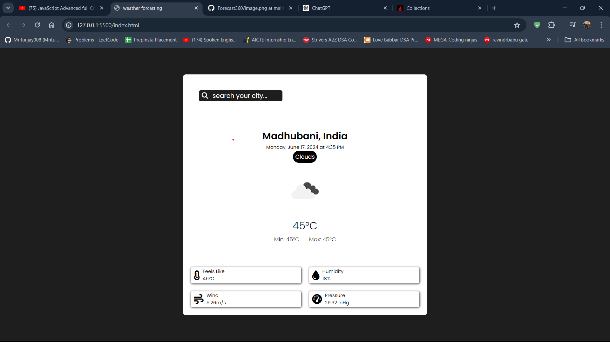
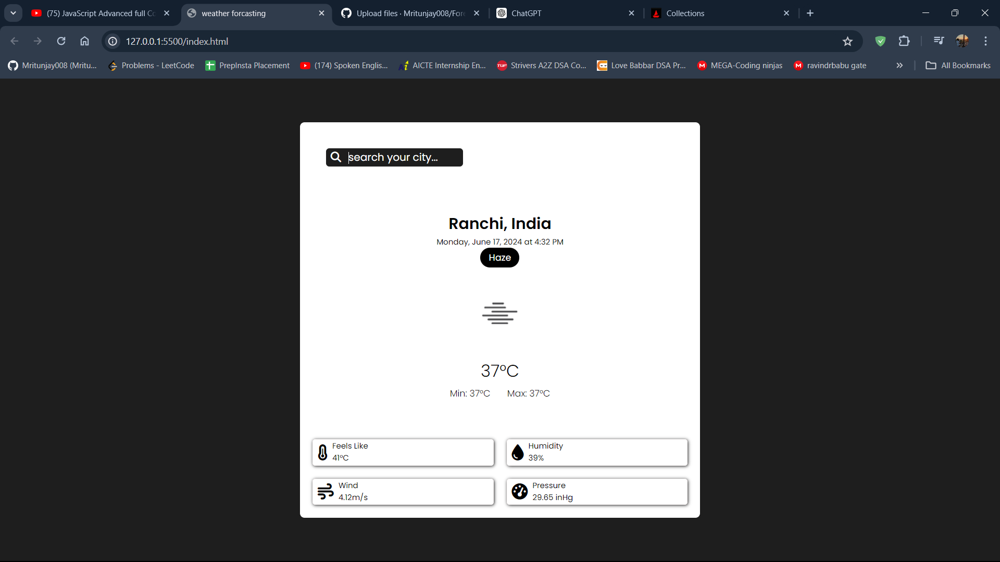

# Weather Forecasting Web App



## Overview

This web application fetches current weather data based on user-inputted city names using the OpenWeatherMap API. It dynamically updates the page with weather conditions including temperature, humidity, wind speed, and more.

## Features

- **Dynamic Weather Data**: Real-time weather updates based on user-provided city names.
- **Responsive Design**: Optimized for various screen sizes and devices.
- **Interactive Search**: Easy-to-use search functionality to fetch weather data instantly.
- **Visual Weather Icons**: Display of weather conditions using intuitive icons.

## Technologies Used

- HTML5
- CSS3 (with Flexbox for layout)
- JavaScript (ES6+)

## How to Use

1. **Enter City Name**: In the search field, type the name of the city you want to check the weather for.
2. **Submit**: Press Enter or click the search button to fetch weather data.
3. **View Weather Information**: See updated weather details displayed on the page, including temperature, humidity, wind speed, and more.

## Screenshots




## Installation

1. Clone the repository:
   ```
   git clone https://github.com/Mritunjay008/weather-app.git
   ```

2. Navigate into the project directory:
   ```
   cd weather-app
   ```

3. Open `index.html` in your web browser.

## API Key (Important)

To run this application, you'll need to sign up for a free API key from [OpenWeatherMap](https://openweathermap.org/api) and replace `'INSERT_YOUR_API_KEY_HERE'` in `script.js` with your actual API key.

```javascript
const apiKey = 'INSERT_YOUR_API_KEY_HERE';
```

## License

This project is licensed under the MIT License - see the [LICENSE](LICENSE) file for details.

## Acknowledgements

- Weather data provided by [OpenWeatherMap API](https://openweathermap.org/api).
- Icons by [Font Awesome](https://fontawesome.com/).

---
